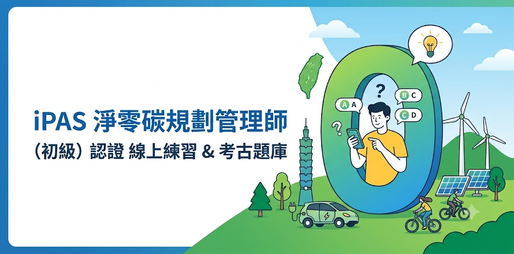

# 淨零碳規劃管理師備考神器

> iPAS 淨零碳規劃管理師（初級）考古題線上練習 —— **免費、免註冊、開啟即用**。
> 每題附一手來源連結；答案與文件對不上時，CI 會擋下來。

[](https://github.com/thc1006/ipas-net-zero-quiz/actions/workflows/quiz-app-deploy.yml)
[](https://github.com/thc1006/ipas-net-zero-quiz/actions/workflows/quiz-app-ci.yml)
[](https://codecov.io/gh/thc1006/ipas-net-zero-quiz)

### ▶ 線上使用：<https://thc1006.github.io/ipas-net-zero-quiz/>



## 題庫

| | 題數 | 說明 |
|---|---:|---|
| **主題庫** | **780 題** | 考科一 434 + 考科二 346。其中 159 題由來源 PDF 分欄重建 |
| **加強練習池**（選用） | **157 題** | 55 題公開模擬題 + 102 題 AI 產題。**預設關閉**，需於設定頁 opt-in |

考科歸屬依官方「iPAS 能力鑑定簡章」§2.5 評鑑內容（`L11` / `L12`）劃分：
CBAM、ISO 14068-1 屬**科目一**；**科目二只涵蓋 ISO 14064-1 與 ISO 14067**。

## 功能

- **練習 / 考試**兩種模式，可依考科與題數出卷
- 每題附**一手來源連結**（環境部、EUR-Lex、IPCC、ISO 等），URL 全部實測可達
- **AI 解析**（Puter.js，免 API key）
- **無障礙**：高對比、色覺辨認（CVD）模式、字級調整、深色模式
- 成績與錯題**匯出**
- AI 產題依 **EU AI Act Art.50**（2026-08-02 起）揭露，UI 顯示警示徽章

## 這份題庫可不可信

> ⚠️ **非官方**備考輔助，題庫仍可能有錯，**最終以 iPAS 官方公告為準**。
> iPAS 不公開歷屆試題，本題庫整理自公開資料與社群共筆。

我們把「可不可信」做成**可以自己驗證的東西**，而不是一句宣稱：

- **每題有出處** —— `sources` / `provenance` 欄位；答案修正一律附實測可達的一手來源 URL
- **重建的題目有證據鏈** —— 159 題逐題記錄來自哪一份 PDF（含 sha256）的哪一頁、哪一欄、
  第幾題，以及 PDF 自己印的 answer key。跑 `python tools/restore_from_source_pdf.py --verify`
  可完整重現（實測 **159/159** 相符）
- **時效性是公開的** —— **112 題**的答案會隨法規變動（CBAM、碳費、NDC、碳中和標準）
- **文件不能對資料說謊** —— README、網站文案、`llms.txt`、甚至 GitHub 的 About，
  上面每個題數都由 CI 對著資料實算比對，對不上就擋下 merge

三件必須誠實講清楚的事：

1. **「查證日期」不代表整份題庫都查到那天** —— 本輪只實查 **100 / 780** 題。
   單一題目請看該題的 `metadata.valid_as_of`。
2. **季排程的連結檢查只驗網址還通不通，驗不出內容變了** ——
   CBAM 繳交期限從 5/31 改成 9/30 時，網址全程都是活的。**綠燈不等於內容正確。**
3. **AI 產題與人工整理的題目嚴格隔離**，AI 產題不會混進主題庫。

📎 已查證到哪一天、**還有什麼沒確定**、下一個到期日（最近：**2026-12-15 ISAE 3410 撤回**）
→ [`CONTENT-CURRENCY.md`](CONTENT-CURRENCY.md)
📎 證據鏈、還原方法、CI gate 如何驗證上述宣稱 → [`DATA-PROVENANCE.md`](DATA-PROVENANCE.md)

## 開發

需要 Node.js ≥ 20 與 pnpm ≥ 9。

```bash
corepack enable && pnpm install

pnpm dev            # 開發（含 schema fail-fast 驗證）
pnpm build          # 建置
pnpm test:run       # 單元測試（vitest）
pnpm test:e2e       # E2E（playwright）
pnpm lint && pnpm type-check
```

**技術棧**：React 18 + TypeScript（strict）／Vite 6／Vitest + Testing Library + Playwright／
GitHub Actions（lint · tsc · test · build · e2e · CodeQL · Codecov）／GitHub Pages 自動部署。

## 授權

雙授權：

- **原始碼** —— `AGPL-3.0-or-later`（見 [`LICENSE`](LICENSE)）
- **本專案自製的題庫、解析與內容** —— `CC-BY-SA-4.0`
- **引用之官方／第三方資料**（iPAS 公開考古題、法規條文、ISO／IPCC／EUR-Lex／環境部等）
  —— 依其各自原始條款，本專案**不主張著作權、不重新授權**，每題保留 `sources` / `provenance` 出處欄位

> **AGPL §13**：若您修改本專案後**以網路服務形式提供**（SaaS／公開網頁／API），
> 必須讓所有使用者能取得**對應修改版的完整原始碼**，授權同樣為 AGPL-3.0-or-later。

## 回報問題

發現錯題或有建議，請至 [Discussions #1](https://github.com/thc1006/ipas-net-zero-quiz/discussions/1)。
