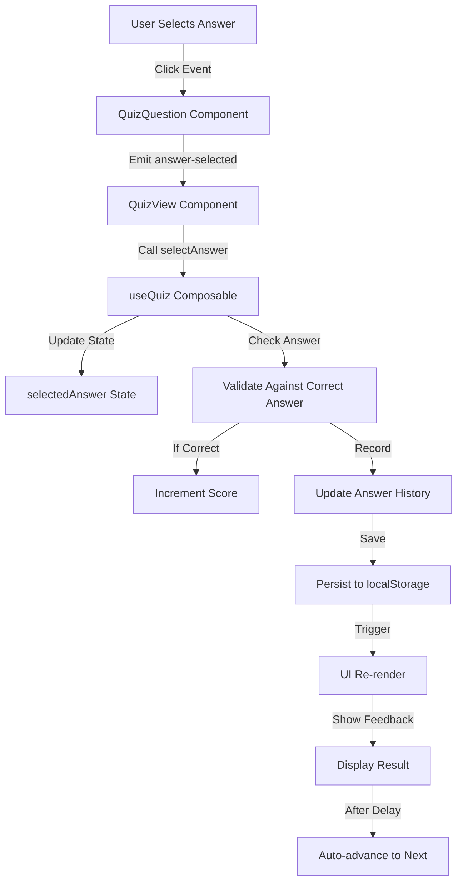

# State Management Flow

## Overview

The iPAS Net Zero Quiz Application implements a sophisticated state management system using Vue 3's Composition API. The state management architecture is centralized in the `useQuiz` composable, providing a single source of truth for all quiz-related data and operations.

## Table of Contents

1. [State Management Architecture](#state-management-architecture)
2. [Data Flow Diagrams](#data-flow-diagrams)
3. [State Lifecycle](#state-lifecycle)
4. [State Persistence](#state-persistence)
5. [Event Flow](#event-flow)
6. [State Synchronization](#state-synchronization)
7. [Performance Optimizations](#performance-optimizations)

---

## State Management Architecture

### Core State Structure

```javascript
// Primary State Objects
{
  // Quiz Content State
  questions: Array<Question>,           // All quiz questions
  originalQuestions: Array<Question>,    // Unmodified questions
  currentQuestionIndex: Number,         // Current position
  
  // User Progress State
  userAnswers: Map<questionId, answer>, // User's answers
  answerHistory: Array<HistoryEntry>,   // Detailed answer log
  selectedAnswer: String|null,          // Current selection
  
  // Quiz Status State
  isQuizStarted: Boolean,              // Quiz started flag
  isQuizCompleted: Boolean,            // Quiz completed flag
  isReviewMode: Boolean,               // Review mode flag
  
  // Timer State
  currentQuestionTime: Number,         // Time on current question
  totalQuizTime: Number,               // Total elapsed time
  timerInterval: Number|null,         // Timer reference
  
  // Configuration State
  shuffleQuestions: Boolean,           // Randomize questions
  shuffleOptions: Boolean,             // Randomize options
  timePerQuestion: Number,             // Time limit per question
  isTimerEnabled: Boolean,             // Timer active flag
  
  // Statistics State
  statistics: {
    totalQuestionsAnswered: Number,
    correctAnswers: Number,
    incorrectAnswers: Number,
    averageTimePerQuestion: Number,
    totalTimeSpent: Number,
    accuracyPercentage: Number,
    questionsReviewed: Number,
    lastSessionDate: String,
    streakCorrect: Number,
    maxStreakCorrect: Number
  }
}
```

### State Management Layers

```
┌─────────────────────────────────────────────────────────────┐
│                      Application Layer                       │
│                         (Vue Components)                     │
└─────────────────────────┬───────────────────────────────────┘
                          ↓ Access via hooks
┌─────────────────────────────────────────────────────────────┐
│                    State Management Layer                    │
│                      (useQuiz Composable)                   │
├─────────────────────────────────────────────────────────────┤
│  ┌─────────────┐  ┌─────────────┐  ┌─────────────┐        │
│  │   Reactive  │  │   Computed  │  │   Methods   │        │
│  │    State    │  │  Properties │  │  (Actions)  │        │
│  └─────────────┘  └─────────────┘  └─────────────┘        │
└─────────────────────────┬───────────────────────────────────┘
                          ↓ Persists to
┌─────────────────────────────────────────────────────────────┐
│                     Persistence Layer                        │
│                        (localStorage)                        │
└─────────────────────────────────────────────────────────────┘
```

---

## Data Flow Diagrams

### Question Answer Flow



### Quiz Initialization Flow

```
┌────────────────────┐
│   Load Questions   │
└──────────┬─────────┘
           ↓
┌────────────────────┐
│  Check localStorage│
│   for Saved State  │
└──────────┬─────────┘
           ↓
     State Exists?
      ┌────┴────┐
      ↓         ↓
     Yes        No
      ↓         ↓
┌──────────┐ ┌──────────┐
│ Restore  │ │Initialize│
│  State   │ │New State │
└────┬─────┘ └────┬─────┘
     └─────┬──────┘
           ↓
┌────────────────────┐
│   Apply Config     │
│  (shuffle, timer)  │
└──────────┬─────────┘
           ↓
┌────────────────────┐
│   Render Quiz UI   │
└────────────────────┘
```

### State Update Cycle

```
User Action → Event Handler → State Mutation → Computed Updates → UI Re-render
     ↑                                                                    ↓
     └────────────────── Feedback Loop ──────────────────────────────────┘
```

---

## State Lifecycle

### 1. Initialization Phase

```javascript
// State initialization sequence
function initializeQuiz(config) {
  // 1. Load configuration
  applyConfiguration(config)
  
  // 2. Prepare questions
  if (config.shuffleQuestions) {
    questions = shuffleArray(originalQuestions)
  }
  
  // 3. Reset tracking state
  currentQuestionIndex = 0
  userAnswers.clear()
  answerHistory = []
  
  // 4. Load saved state if exists
  loadFromStorage()
  
  // 5. Start timers if enabled
  if (isTimerEnabled) {
    startQuestionTimer()
  }
}
```

### 2. Active Quiz Phase

```javascript
// State during active quiz
{
  lifecycle: 'active',
  operations: [
    'answerQuestion',    // Record user answers
    'nextQuestion',      // Navigate forward
    'previousQuestion',  // Navigate backward
    'goToQuestion',      // Jump to specific question
    'updateTimer',       // Track time spent
    'saveProgress'       // Auto-save state
  ]
}
```

### 3. Completion Phase

```javascript
// State at quiz completion
function completeQuiz() {
  // 1. Stop all timers
  stopQuestionTimer()
  
  // 2. Mark as completed
  isQuizCompleted = true
  
  // 3. Calculate final statistics
  updateFinalStatistics()
  
  // 4. Persist results
  saveToStorage()
  
  // 5. Prepare for review mode
  prepareReviewData()
}
```

### 4. Review Phase

```javascript
// State during review
{
  lifecycle: 'review',
  features: [
    'Navigate all questions',
    'View correct answers',
    'See explanations',
    'Check time spent',
    'No score changes'
  ]
}
```

---

## State Persistence

### localStorage Schema

```javascript
// Storage structure
const STORAGE_SCHEMA = {
  'ipas-quiz-state': {
    currentQuestionIndex: Number,
    isQuizStarted: Boolean,
    isQuizCompleted: Boolean,
    isReviewMode: Boolean,
    totalQuizTime: Number,
    questions: Array
  },
  
  'ipas-quiz-answers': Map<String, String>,
  
  'ipas-quiz-statistics': {
    totalQuestionsAnswered: Number,
    correctAnswers: Number,
    incorrectAnswers: Number,
    averageTimePerQuestion: Number,
    totalTimeSpent: Number,
    accuracyPercentage: Number,
    questionsReviewed: Number,
    lastSessionDate: String,
    streakCorrect: Number,
    maxStreakCorrect: Number
  },
  
  'ipas-quiz-config': {
    shuffleQuestions: Boolean,
    shuffleOptions: Boolean,
    timePerQuestion: Number,
    isTimerEnabled: Boolean
  }
}
```

### Persistence Strategy

```javascript
// Auto-save strategy
const PERSISTENCE_STRATEGY = {
  trigger: 'state_change',
  debounce: 500, // ms
  events: [
    'answer_submitted',
    'question_navigated',
    'quiz_completed',
    'config_changed'
  ],
  fallback: 'memory_only'
}
```

### Data Recovery Flow

```
┌──────────────────┐
│  Page Load/Refresh│
└────────┬─────────┘
         ↓
┌──────────────────┐
│Check localStorage│
└────────┬─────────┘
         ↓
    Data Exists?
     ┌───┴───┐
     ↓       ↓
    Yes      No
     ↓       ↓
┌─────────┐ ┌─────────┐
│Validate │ │  Fresh  │
│  Data   │ │  Start  │
└────┬────┘ └─────────┘
     ↓
  Valid?
  ┌──┴──┐
  ↓     ↓
 Yes    No
  ↓     ↓
┌──────┐ ┌──────┐
│Restore│ │Reset │
└──────┘ └──────┘
```

---

## Event Flow

### Event Architecture

```
Component Events → State Actions → State Mutations → Side Effects
```

### Event Mapping

| User Action | Component Event | State Action | State Changes |
|-------------|----------------|--------------|---------------|
| Click answer option | `@answer-selected` | `answerQuestion()` | selectedAnswer, userAnswers, score |
| Click next button | `@next` | `nextQuestion()` | currentQuestionIndex, timer |
| Click previous | `@previous` | `previousQuestion()` | currentQuestionIndex |
| Click restart | `@restart` | `resetQuiz()` | All state reset |
| Timer expires | `timer-expired` | `handleTimeUp()` | Auto-advance, record no answer |

### Event Processing Pipeline

```javascript
// Event processing flow
class EventProcessor {
  process(event) {
    // 1. Validate event
    if (!this.isValidEvent(event)) return
    
    // 2. Pre-process
    this.beforeAction(event)
    
    // 3. Execute action
    const result = this.executeAction(event)
    
    // 4. Update state
    this.updateState(result)
    
    // 5. Side effects
    this.handleSideEffects(result)
    
    // 6. Persist
    this.saveToStorage()
    
    // 7. Notify subscribers
    this.notifySubscribers(event, result)
  }
}
```

---

## State Synchronization

### Component-State Synchronization

```javascript
// Synchronization pattern
const QuizComponent = {
  setup() {
    const quiz = useQuiz()
    
    // One-way data binding
    const question = computed(() => quiz.currentQuestion)
    
    // Two-way synchronization
    const answer = computed({
      get: () => quiz.currentQuestionAnswer,
      set: (value) => quiz.answerQuestion(value)
    })
    
    // Watch for changes
    watch(() => quiz.isQuizCompleted, (completed) => {
      if (completed) handleCompletion()
    })
    
    return { question, answer }
  }
}
```

### Cross-Component Communication

```
┌──────────────┐     State      ┌──────────────┐
│ Component A  │────────────────→│   useQuiz    │
└──────────────┘                 └──────┬───────┘
                                         ↓
┌──────────────┐                        ↓
│ Component B  │←────────────────────────┘
└──────────────┘     Updates
```

### Real-time State Updates

```javascript
// Real-time update flow
const realtimeUpdates = {
  // Timer updates every second
  timer: {
    interval: 1000,
    update: () => {
      currentQuestionTime.value++
      totalQuizTime.value++
    }
  },
  
  // Progress updates on answer
  progress: {
    trigger: 'answer_submitted',
    update: () => {
      updateProgress()
      updateStatistics()
    }
  },
  
  // Auto-save every 30 seconds
  autoSave: {
    interval: 30000,
    update: () => saveToStorage()
  }
}
```

---

## Performance Optimizations

### State Optimization Strategies

#### 1. Computed Property Caching

```javascript
// Expensive computations cached
const score = computed(() => {
  // Only recalculates when dependencies change
  let correct = 0
  userAnswers.forEach((answer, questionId) => {
    const question = findQuestion(questionId)
    if (answer === question.answer) correct++
  })
  return {
    correct,
    total: userAnswers.size,
    percentage: (correct / userAnswers.size) * 100
  }
})
```

#### 2. Debounced Persistence

```javascript
// Debounce storage writes
const debouncedSave = debounce(() => {
  saveToStorage()
}, 500)

// Use in state updates
function updateState(changes) {
  Object.assign(state, changes)
  debouncedSave()
}
```

#### 3. Selective Re-rendering

```javascript
// Only update affected components
const questionSpecificState = computed(() => ({
  question: currentQuestion.value,
  answer: currentQuestionAnswer.value,
  feedback: currentQuestionFeedback.value
}))

// Components watch specific slices
watch(questionSpecificState, updateQuestionUI)
```

#### 4. Memory Management

```javascript
// Clean up unused data
function cleanupMemory() {
  // Clear old history beyond limit
  if (answerHistory.value.length > 100) {
    answerHistory.value = answerHistory.value.slice(-100)
  }
  
  // Clear timer references
  if (timerInterval.value) {
    clearInterval(timerInterval.value)
    timerInterval.value = null
  }
}
```

### Performance Metrics

| Operation | Target Time | Optimization |
|-----------|-------------|--------------|
| State Update | < 16ms | Batch updates |
| Storage Write | < 50ms | Debouncing |
| Navigation | < 100ms | Precomputed values |
| Score Calculation | < 10ms | Memoization |
| UI Re-render | < 16ms | Virtual DOM diffing |

---

## State Debugging

### Debug Tools

```javascript
// State debugging utilities
const DEBUG_TOOLS = {
  // Log state changes
  logStateChange(property, oldValue, newValue) {
    console.log(`State Change: ${property}`, {
      old: oldValue,
      new: newValue,
      timestamp: Date.now()
    })
  },
  
  // State snapshot
  getStateSnapshot() {
    return {
      state: toRaw(state),
      computed: {
        score: score.value,
        progress: progressPercentage.value
      },
      storage: {
        answers: localStorage.getItem('ipas-quiz-answers'),
        state: localStorage.getItem('ipas-quiz-state')
      }
    }
  },
  
  // State validation
  validateState() {
    const issues = []
    if (currentQuestionIndex.value >= questions.value.length) {
      issues.push('Index out of bounds')
    }
    if (userAnswers.size > questions.value.length) {
      issues.push('Too many answers')
    }
    return issues
  }
}
```

### State Inspection

```javascript
// Development mode state inspection
if (import.meta.env.DEV) {
  window.__QUIZ_STATE__ = {
    getState: () => getStateSnapshot(),
    setState: (newState) => Object.assign(state, newState),
    reset: () => resetQuiz(),
    validate: () => validateState()
  }
}
```

---

## State Patterns and Anti-Patterns

### Best Practices ✅

```javascript
// Good: Immutable updates
const newQuestions = [...questions.value].sort(randomSort)

// Good: Computed for derived state
const isLastQuestion = computed(() => 
  currentQuestionIndex.value === questions.value.length - 1
)

// Good: Single source of truth
const score = computed(() => calculateScore(userAnswers))
```

### Anti-Patterns ❌

```javascript
// Bad: Direct state mutation
questions.value.push(newQuestion) // Breaks reactivity

// Bad: Duplicate state
let localScore = 0 // Use computed instead

// Bad: Side effects in computed
const result = computed(() => {
  saveToStorage() // Side effect!
  return score
})
```

---

## State Testing Strategy

### Unit Testing State

```javascript
describe('Quiz State Management', () => {
  it('should initialize with default values', () => {
    const quiz = useQuiz([])
    expect(quiz.currentQuestionIndex.value).toBe(0)
    expect(quiz.isQuizStarted.value).toBe(false)
  })
  
  it('should update score on correct answer', () => {
    const quiz = useQuiz(mockQuestions)
    quiz.answerQuestion('A')
    expect(quiz.score.value.correct).toBe(1)
  })
  
  it('should persist state to localStorage', () => {
    const quiz = useQuiz(mockQuestions)
    quiz.saveToStorage()
    expect(localStorage.getItem('ipas-quiz-state')).toBeDefined()
  })
})
```

### Integration Testing

```javascript
describe('State Integration', () => {
  it('should maintain state across components', async () => {
    const wrapper = mount(QuizView)
    const quiz = wrapper.vm.quiz
    
    // Simulate user interaction
    await wrapper.find('.answer-option').trigger('click')
    
    // Verify state propagation
    expect(quiz.userAnswers.size).toBe(1)
    expect(wrapper.find('.score').text()).toContain('1')
  })
})
```

---

## Future Enhancements

### Planned State Management Improvements

1. **State Machines**
   - Implement finite state machines for quiz flow
   - Prevent invalid state transitions
   - Better predictability

2. **Time-Travel Debugging**
   - Record all state mutations
   - Replay state changes
   - Undo/redo functionality

3. **Optimistic Updates**
   - Immediate UI feedback
   - Background synchronization
   - Rollback on failure

4. **State Encryption**
   - Encrypt sensitive data
   - Secure storage
   - Data integrity checks

5. **Multi-Tab Synchronization**
   - Sync state across browser tabs
   - Conflict resolution
   - Real-time updates

---

*Last Updated: 2025-08-21*